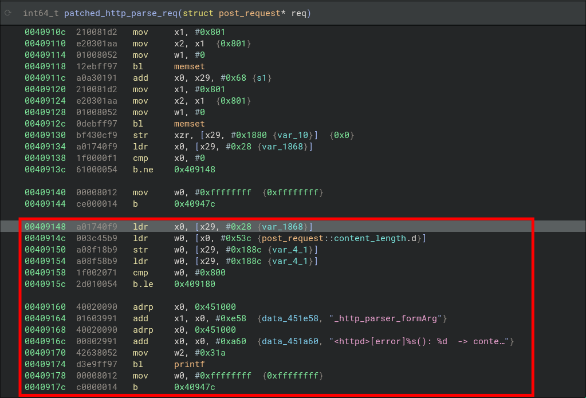

+++
title = 'Meu Primeiro 0day - TP-Link EAP 773 DoS/RCE'
date = 2024-12-16
draft = false
+++

Este post está atrasado há alguns meses. Haha. Reportei essa vulnerabilidade em Maio, e acredito que o firmware corrigido já tenha sido publicado.

Então, este é um pequeno write-up sobre a vulnerabilidade e como a TP-Link a corrigiu.
<!--more-->
---

## A falha

O painel de configuração web do EAP 773 é um servidor HTTP customizado, localizado em `/usr/bin/httpd_portal`, e recebe requisições POST em endpoints terminados com o sufixo `.json`.

O corpo destas requisições sempre incluí dois paramêtros, `operation` (que pode ser `read` ou `write`) e `data`. O paramêtro `data` é utilizado quando `operation` é definido como `write`, e é vulnerável a stack buffer overflow.

Prova-de-Conceito (PoC) de DoS em um endpoint não-autenticado:

```
curl -X POST -d "operation=write&data=$(python3 -c "print('A'*2221)")" 192.168.0.1/data/energysave.config.json
```

Confirmei com GDB que RCE é possível, mas não incluirei detalhes deste exploit aqui para evitar possível abuso por parte de script kiddies.


## O fix da TP-Link

Olhando o *binary diff* entre as versões do firmware, encontrei a função vulnerável e seu patch.

A correção introduz uma verificação do tamanho da requisição (checa se é menor do que 0x800 bytes) antes de ler do *file descriptor* do socket e escrever no buffer.


