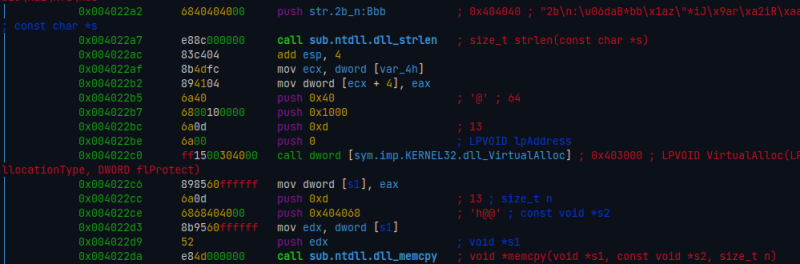
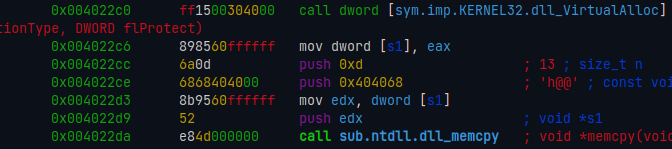
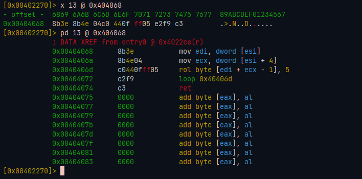
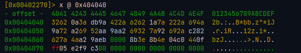
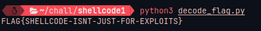

+++
title = 'Decifrando os Desafios de Análise Estática do MalwareTech [shellcode1]'
date = 2023-11-08T03:26:26-03:00
draft = false
+++

Até recentemente, eu nunca tinha tentado algum dos "Beginner Reverse Engineering Challenges" ("Desafios de Engenharia Reversa para Iniciantes") do [MalwareTech](https://malwaretech.com) como parte dos meus estudos, mesmo sabendo da existencia destes há algum tempo. Não tenho nenhum motivo em especifico, apenas nunca os tentei antes.

Mas hoje eu comecei a resolver esses desafios por pura diversão, aqui está minha solução para o desafio `shellcode1`.

<!--more-->
---

## O quê nós já sabemos?

Na descrição do desafio lê-se...

> Codigo Posicionalmente-Independente (vulgo Shellcode) é código assembly cujo qual pode ser simplesmente copiado para uma localização na memória e executado dali. Devido à falta de necessidade de carregamento de inicialização complexos, shellcodes são populares para vários objetivos como injeção de código. Estes desafios foram feitos para testar sua habilidade em analisar shellcode malicioso.

O quê podemos deduzir disto é que o binário dado para o desafio irá, obviamente, rodar um shellcode. Para um shellcode ser executado, ele precisa ser mapeado para alguma área na memória, para onde a execução será passada.

O que isto significa é que o executável que o desafio nós deu precisa de, primeiro, alocar um pouco de espaço em algum lugar da memória, copiar o código posicionalmente-independente / shellcode para dito espaço e, então, passá-lo a execução do programa.

Como o desafio é mais focado em Windows, posso inferir que provavelmente usa `VirtualAlloc` para alocações de memória.

Bom, hora de olharmos o código.

## Encontrando o shellcode

Para este desafio, usei o radare2.

Comecei com o disassembly do entrypoint do binário, cujo qual parece ser a função `main` (ao invés de um carregador para uma "`main` real"). Então eu procurei por uma chamada à `kernel32!VirtualAlloc` seguida por uma chamada à `ntdll!memcpy`, e certamente aqui está!



Nós sabemos que `ntdll!memcpy` deve copiar o shellcode de algum lugar do binário para a memória alocada. Nós podemos ver no código que ele copia 13 (`0xd`) bytes do endereço `0x404068` para o novo espaço de memória.



`0x404068` deve ser onde nosso shellcode está localizado no binário, e ele tem 13 bytes em comprimento!

Vamos inspecioná-lo...



## Analisando o shellcode

Ele começa carregando um endereço de memória de `esi` para `edi`.

```nasm
0x00404068      8b3e           mov edi, dword [esi]
```

Em seguida, ele carrega algum valor em `ecx`.

```nasm
0x0040406a      8b4e04         mov ecx, dword [esi + 4]
```

O registrador `ecx` é normalmente usado como um cotador para instruções de loop, o quê as proximas duas instruções efetivamente fazem.

```nasm
0x0040406d      c0440fff05      rol byte [edi + ecx - 1], 5
0x00404072      e2f9            loop 0x40406d
0x00404074      c3              ret
```

A instrução `loop 0x40406d` realiza um loop, fazendo o fluxo de execução do programa voltar à `0x40406d` toda vez que é chamado, decrementando o valor no registrador `ecx`. Quando `ecx` se torna 0, o loop é quebrado e o fluxo do programa continua normalmente para a próxima instrução (`ret`), cuja qual termina a execução do shellcode e volta ao binário principal.

`rol` é a operação de rotação bit-a-bit à esquerda. Aqui, os bytes no endereço apontado por `edi + ecx - 1` são rotacionados-à-esquerda 5 vezes.

À cada vez que a instrução `rol` é repetida pelo loop, uma dada string é iterada do fim para o começo, onde cada um de seus bytes é rotacionado-à-esquerda 5 vezes.

Nós podemos inferir disso é que a flag codificada está armezanada no endereço apontado por `edi`, cujo valor é pôsto antes da chamada do shellcode, e todos os bytes dela precisam ser rotacionados-à-esquerda para decodificá-la.

## Decodificando a flag

Olhando de volta para a função de entrypoint, podemos ver que `0x404040` é atribuido à `edi` logo antes da execução ser passada para o shellcode.

![Disassembly do radare2 mostrando dword [var_4h] sendo atribuido como valor à esi antes da execução do shellcode.](radare_404040_part1.png)

![Disassembly do radare2 mostrando 0x404040 sendo atribuido como valor à dword [var_4h].](radare_404040_part2.png)

Então a flag codificada deve estar guardada em `0x404040`! Inspecionando-a...



Aqui está! Eu copiei os bytes de `0x404040` até `0x404066` (onde o byte `0x00` aparece, indicando o fim da string).

Finalmente, fiz um script em python para decodificar a flag.

```python
#!/usr/bin/env python3

def rotate_left(byte, n):
    return ((byte << n) | (byte >> (8 - n))) & 0xFF

ENCODED_FLAG = bytearray(b"\x32\x62\x0a\x3a\xdb\x9a\x42\x2a\x62\x62\x1a\x7a\x22\x2a\x69\x4a\x9a\x72\xa2\x69\x52\xaa\x9a\xa2\x69\x32\x7a\x92\x69\x2a\xc2\x82\x62\x7a\x4a\xa2\x9a\xeb\x00")

decoded_flag = bytearray(b"X" * len(ENCODED_FLAG)) # a letra "X" é um placeholder

for i in range(0, len(ENCODED_FLAG)):
    decoded_flag[i] = rotate_left(ENCODED_FLAG[i], 5)

print(str(decoded_flag, "ascii"))
```

E então obtivemos nossa flag!



Yaaayyyyy!!
