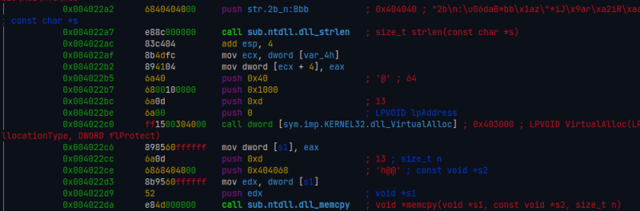
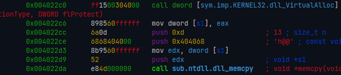
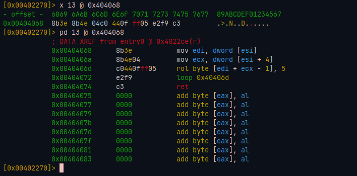
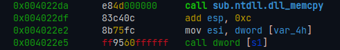
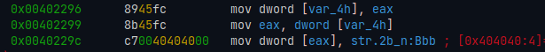
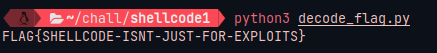

+++
title = "Deciphering MalwareTech's Static Analysis Challenges [shellcode1]"
date = "2023-11-08"
draft = false
+++

Up until recently, I'd never tried the "Beginner Reverse Engineering Challenges" from [MalwareTech](https://malwaretech.com) as part of my studies, even after knowing their existence for quite some time. I don't have a exact reason, I just hadn't tried them before.

But today I began solving those challenges for pure fun, here is my solution to the `shellcode1` challenge.
<!--more--->
---

## What we already know?

The challenge description reads...

> Position independent code (AKA Shellcode) is assembly code which can simply be copied to a memory location and run. Due to the lack of need for complex loading & initialization, it is popular for many tasks such as code injection. These challenges are designed to test your ability to reverse engineer malware shellcode.

What we can deduce from this is that the provided binary will, obviously, run a shellcode. For a shellcode to be run, it needs to be mapped to some area in memory where it can be executed from.

What this means is that the challenge provided binary needs to first allocate some space somewhere in memory, copy the position independent code to such space, and then pass execution to it.

As the challenge is windows focused, I can infer it probably uses `VirtualAlloc` for memory allocation.

Well, we shall look into the code.

## Finding the shellcode 

For this challenge, I used radare2.

I began by disassembling the binary's entrypoint, which doesn't seem to be a stub to a `main` function. So I looked out for a call to `VirtualAlloc` followed by a call to `memcpy`, and sure here it is!



We know that `memcpy` should copy the shellcode from somewhere in the binary to the allocated memory. We can see in the code that it copies 13 (`0xd`) bytes from address `0x404068` to the new memory space.



`0x404068` should be where our shellcode is stored in the binary, and it is 13 bytes long!

Let's dump it...



## Analyzing the shellcode

It begins by loading an address from `esi` into `edi`.

```nasm
0x00404068      8b3e           mov edi, dword [esi]
```

Next, it loads some value into `ecx`.

```nasm
0x0040406a      8b4e04         mov ecx, dword [esi + 4]
```

The `ecx` register is commonly used as a loop counter, which the next two instructions effectively do.

```nasm
0x0040406d      c0440fff05     rol byte [edi + ecx - 1], 5
0x00404072      e2f9           loop 0x40406d
0x00404074      c3             ret
```

The `loop 0x40406d` instruction loops the execution to `0x40406d` every time it is hit, decrementing the `ecx` register. When `ecx` becomes 0, it stops looping back and passes execution to the next instruction (`ret`) which exits off the shellcode.

`rol` is the bitwise left-rotation operation. Here, it left-rotates the byte at address pointed by `edi + ecx - 1`, 5 times.

As `rol` instruction loops and the `ecx` register decrements, the given string is iterated backwards, left-rotating every byte on it 5 times in a roll.

We can infer from this is that the encoded flag string is stored in the address pointed by `edi`, which is set before the shellcode being called, and all (or some) bytes from it needs to be left-rotated for decoding.

## Decoding the flag

By looking back at the entrypoint function, we see that `edi` is set to `0x404040` right before the execution being passed to the shellcode.





So, the encoded flag should be stored at `0x404040`! Dumping it...


Here it is! I copied the bytes from `0x404040` to `0x404066` (where a `0x00` byte appears, which indicates a string's end).

Finally, here's a python script I made for decoding it.

```python
#!/usr/bin/env python3

def rotate_left(byte, n):
    return ((byte << n) | (byte >> (8 - n))) & 0xFF

ENCODED_FLAG = bytearray(b"\x32\x62\x0a\x3a\xdb\x9a\x42\x2a\x62\x62\x1a\x7a\x22\x2a\x69\x4a\x9a\x72\xa2\x69\x52\xaa\x9a\xa2\x69\x32\x7a\x92\x69\x2a\xc2\x82\x62\x7a\x4a\xa2\x9a\xeb\x00")

decoded_flag = bytearray(b"X" * len(ENCODED_FLAG)) # the letter "X" is a placeholder

for i in range(0, len(ENCODED_FLAG)):
    decoded_flag[i] = rotate_left(ENCODED_FLAG[i], 5)

print(str(decoded_flag, "ascii"))
```

And then we get our flag!



Yaaayyyyy!!
